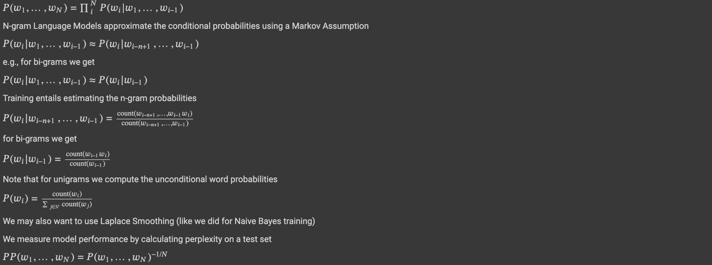

# N-GRAM Language Model for Sentence Generation

### Background




## Implementation Steps

1. **Data Preprocessing**:
   - Tokenize the input text data.
   - Create n-gram counts for each word sequence.
   
2. **Probability Estimation**:
   - Compute the probability of each n-gram using maximum likelihood estimation (MLE).
   
3. **Smoothing**:
   - Apply Laplace Smoothing to handle zero-frequency n-grams.
   
4. **Perplexity Calculation**:
   - Calculate the perplexity on the test set to evaluate the model.
   
## Example
For a **bigram** model, the training entails estimating:

$$ P(w_i | w_{i-1}) = \frac{\text{count}(w_{i-1}, w_i)}{\text{count}(w_{i-1})} $$

The test perplexity is given by:

$$ PP(w_1, \ldots, w_N) = \left( \prod_{i=1}^N P(w_i | w_{i-1}) \right)^{-\frac{1}{N}} $$

## Usage

The model can be implemented in Python, using libraries like `nltk` for text preprocessing and `collections` for managing n-gram counts. Key steps include:
- **Tokenization**
- **Building n-gram Counts**
- **Probability Estimation**
- **Model Evaluation** using perplexity.

- Running the following will provide scores for Unigram, Bigram. 

```python
    python process.py
```
- To train a 'n' gram model, modify the 'n' value in the ```train_test_lm()``` function as below:

```python
    n_gram_lm = train_test_lm(n, bool)
```